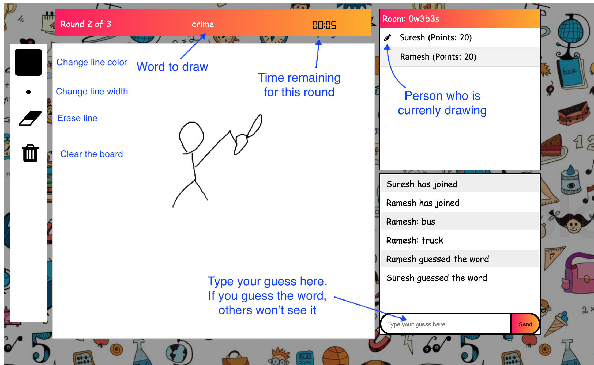

# Pictionary game

## About Pictionary
Pictionary is game players with 2 more players as a team. 
One player would think of a word and draws it in a whiteboard, ther others would try to guess the word.
Whoever finds the word correctly wins. 

The game is deployed in heroku and you can
[Play the game here](https://play-pictionary.herokuapp.com/)

## How to play
- Open the above link. It will take you to the home screen of the game.
- In the home screen you can either Create a room, or Join a room.
- After you have created a room (if you are the creator), you will be seeing the lading screen with room code.
Invite others and wait for all them to join and hit the play button.
- Once the game begins, each player will get to draw a word for each round. The drawing board will be enabled for the active player. 
- Players can type their guesses in the guess text field in the bottom left

## Screenshot

## Contributing
Visit the [Contributing](./CONTRIBUTING.md) page
  
## License
GNU General Public License v3.0
